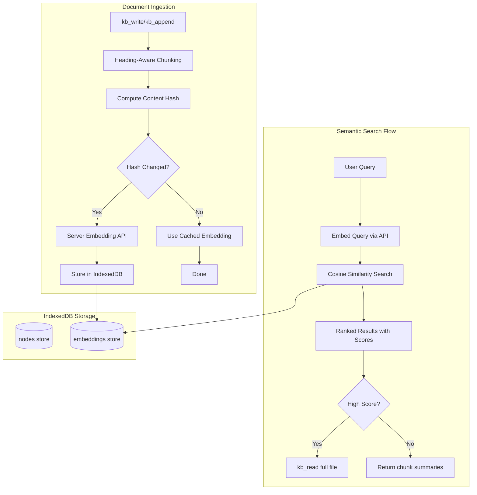
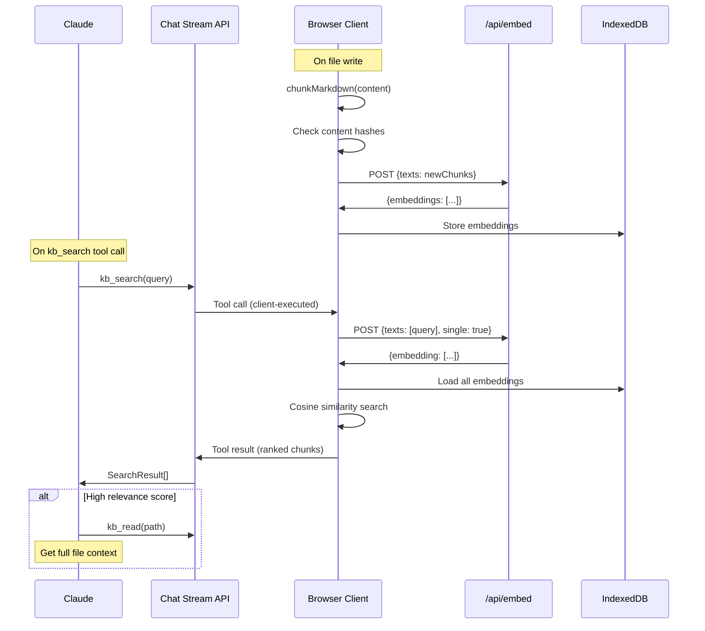

# RAG Semantic Search for Knowledge Base

## Architecture Overview

The current knowledge base uses a "tool call search" pattern where Claude must manually navigate folders and read files. This document outlines the implementation plan for **semantic search via embeddings** that allows Claude to find relevant content by meaning, then optionally retrieve full files.

**Inspired by Cursor's approach**: We use content hashing to avoid re-embedding unchanged content, and store embeddings locally in IndexedDB for fast similarity search.



## Key Design Decisions

### 1. Embedding Model: OpenAI `text-embedding-3-small` (server-side)

- 1536-dimensional vectors (high quality)
- ~$0.02 per 1M tokens (very cheap)
- No client-side model download
- Fast embedding via API
- Better semantic understanding than browser models

### 2. Chunking Strategy: Heading-aware with paragraph fallback

- Primary split on Markdown headings (`#`, `##`, `###`)
- Fallback to paragraph boundaries for long sections
- Max ~500 tokens per chunk
- Preserve heading context in each chunk
- Store chunk metadata (source file, heading path, position)

### 3. Storage: Extend existing IndexedDB schema (Cursor-inspired)

- New `embeddings` object store with:
  - Content hash for change detection (avoid re-embedding)
  - Embedding vectors for similarity search
  - Link back to source file paths
- Re-embed only when content hash changes

### 4. Search Tool: New `kb_search` tool for Claude

- Returns ranked chunks with relevance scores (0-1)
- Includes chunk text preview, source path, and heading context
- Claude decides whether to `kb_read` full file based on quality

---

## Implementation Details

### 1. Server-Side Embedding API

**New file: `app/api/embed/route.ts`**

API route that generates embeddings using OpenAI:

```typescript
import { openai } from "@ai-sdk/openai";
import { embedMany, embed } from "ai";

export async function POST(req: Request) {
  const { texts, single } = await req.json();
  
  if (single) {
    // Single query embedding
    const { embedding } = await embed({
      model: openai.embedding("text-embedding-3-small"),
      value: texts[0],
    });
    return Response.json({ embedding });
  }
  
  // Batch embedding for document chunks
  const { embeddings } = await embedMany({
    model: openai.embedding("text-embedding-3-small"),
    values: texts,
  });
  return Response.json({ embeddings });
}
```

**New file: `knowledge/embeddings/embed-client.ts`**

Client-side service to call the embedding API:

```typescript
export async function embedTexts(texts: string[]): Promise<number[][]> {
  const res = await fetch("/api/embed", {
    method: "POST",
    body: JSON.stringify({ texts }),
  });
  const { embeddings } = await res.json();
  return embeddings;
}

export async function embedQuery(query: string): Promise<number[]> {
  const res = await fetch("/api/embed", {
    method: "POST", 
    body: JSON.stringify({ texts: [query], single: true }),
  });
  const { embedding } = await res.json();
  return embedding;
}
```

### 2. Extend IndexedDB Schema

**Modify: `knowledge/idb.ts`**

Add new `embeddings` store with content hashing (Cursor-inspired):

```typescript
interface EmbeddingRecord {
  id: string;           // unique chunk id: `${filePath}#${chunkIndex}`
  filePath: string;     // source file path
  chunkIndex: number;   // position in file
  chunkText: string;    // the actual text chunk (for display)
  contentHash: string;  // SHA-256 hash of chunk text (for change detection)
  headingPath: string;  // e.g., "Projects > API Design > Authentication"
  embedding: number[];  // 1536-dim vector (text-embedding-3-small)
  updatedAt: number;
}

interface KnowledgeDbSchema extends DBSchema {
  nodes: { ... };  // existing
  embeddings: {
    key: string;
    value: EmbeddingRecord;
    indexes: { 
      'by-file': string;      // for deleting all embeddings when file deleted
      'by-hash': string;      // for checking if chunk already embedded
    };
  };
}
```

Bump schema version from 1 to 2 within the same `knowledge_v1` database (preserves existing data).

### 3. Heading-Aware Markdown Chunker

**New file: `knowledge/embeddings/chunker.ts`**

Hybrid chunking that respects Markdown structure:

```typescript
interface Chunk {
  text: string;
  index: number;
  headingPath: string;    // breadcrumb of headings: "Section > Subsection"
  startOffset: number;
  endOffset: number;
}

/**
 * Chunks Markdown content by headings first, then paragraphs for long sections.
 * 
 * Algorithm:
 * 1. Parse document into heading-delimited sections
 * 2. For each section:
 *    - If under maxTokens, keep as single chunk
 *    - If over, split on paragraph boundaries (\n\n)
 *    - If still over, split on sentence boundaries
 * 3. Prepend heading context to each chunk for better embedding
 */
export function chunkMarkdown(content: string, maxTokens = 500): Chunk[] {
  const headingRegex = /^(#{1,6})\s+(.+)$/gm;
  // ... implementation
}

// Helper to estimate tokens (rough: 1 token ≈ 4 chars for English)
function estimateTokens(text: string): number {
  return Math.ceil(text.length / 4);
}

// Helper to build heading breadcrumb
function buildHeadingPath(headingStack: string[]): string {
  return headingStack.join(" > ");
}
```

**Example output for a document:**

```markdown
# Projects
## API Design
### Authentication
Uses JWT tokens with 1-hour expiry...
```

Produces chunk with:
- `text`: "Authentication\n\nUses JWT tokens with 1-hour expiry..."
- `headingPath`: "Projects > API Design > Authentication"

### 4. Embedding Operations (with Hash-Based Caching)

**New file: `knowledge/embeddings/operations.ts`**

```typescript
import { chunkMarkdown } from "./chunker";
import { embedTexts, embedQuery } from "./embed-client";
import { getKnowledgeDb } from "../idb";

/**
 * Embed a file's content, using hash-based caching to avoid re-embedding.
 * Inspired by Cursor's Merkle tree approach for efficient updates.
 */
export async function embedFile(path: string, content: string): Promise<void> {
  const db = await getKnowledgeDb();
  const chunks = chunkMarkdown(content);
  
  // Get existing embeddings for this file
  const existingByHash = new Map<string, EmbeddingRecord>();
  const existing = await db.getAllFromIndex("embeddings", "by-file", path);
  existing.forEach(e => existingByHash.set(e.contentHash, e));
  
  // Determine which chunks need embedding (hash changed or new)
  const toEmbed: { chunk: Chunk; hash: string }[] = [];
  const toKeep: EmbeddingRecord[] = [];
  
  for (const chunk of chunks) {
    const hash = await sha256(chunk.text);
    if (existingByHash.has(hash)) {
      // Reuse existing embedding
      toKeep.push(existingByHash.get(hash)!);
    } else {
      toEmbed.push({ chunk, hash });
    }
  }
  
  // Batch embed only new/changed chunks
  if (toEmbed.length > 0) {
    const embeddings = await embedTexts(toEmbed.map(c => c.chunk.text));
    
    for (let i = 0; i < toEmbed.length; i++) {
      const { chunk, hash } = toEmbed[i];
      await db.put("embeddings", {
        id: `${path}#${chunk.index}`,
        filePath: path,
        chunkIndex: chunk.index,
        chunkText: chunk.text,
        contentHash: hash,
        headingPath: chunk.headingPath,
        embedding: embeddings[i],
        updatedAt: Date.now(),
      });
    }
  }
  
  // Delete stale embeddings (chunks that no longer exist)
  const currentIds = new Set(chunks.map((_, i) => `${path}#${i}`));
  for (const e of existing) {
    if (!currentIds.has(e.id)) {
      await db.delete("embeddings", e.id);
    }
  }
}

/**
 * Delete all embeddings for a file.
 */
export async function deleteFileEmbeddings(path: string): Promise<void> {
  const db = await getKnowledgeDb();
  const embeddings = await db.getAllFromIndex("embeddings", "by-file", path);
  for (const e of embeddings) {
    await db.delete("embeddings", e.id);
  }
}

/**
 * Semantic search across all embeddings using cosine similarity.
 */
export async function searchEmbeddings(
  query: string,
  topK: number = 5,
  threshold: number = 0.3
): Promise<SearchResult[]> {
  const db = await getKnowledgeDb();
  const queryEmbedding = await embedQuery(query);
  
  // Load all embeddings (fine for <10K chunks)
  const allEmbeddings = await db.getAll("embeddings");
  
  // Compute cosine similarity for each
  const scored = allEmbeddings.map(e => ({
    ...e,
    score: cosineSimilarity(queryEmbedding, e.embedding),
  }));
  
  // Filter by threshold and sort by score
  return scored
    .filter(e => e.score >= threshold)
    .sort((a, b) => b.score - a.score)
    .slice(0, topK)
    .map(e => ({
      filePath: e.filePath,
      chunkText: e.chunkText,
      headingPath: e.headingPath,
      score: e.score,
      chunkIndex: e.chunkIndex,
    }));
}

// Cosine similarity between two vectors
function cosineSimilarity(a: number[], b: number[]): number {
  let dot = 0, normA = 0, normB = 0;
  for (let i = 0; i < a.length; i++) {
    dot += a[i] * b[i];
    normA += a[i] * a[i];
    normB += b[i] * b[i];
  }
  return dot / (Math.sqrt(normA) * Math.sqrt(normB));
}

// SHA-256 hash for content change detection
async function sha256(text: string): Promise<string> {
  const encoder = new TextEncoder();
  const data = encoder.encode(text);
  const hash = await crypto.subtle.digest("SHA-256", data);
  return Array.from(new Uint8Array(hash))
    .map(b => b.toString(16).padStart(2, "0"))
    .join("");
}
```

### 5. New `kb_search` Tool

**Modify: `tools/knowledge-tools.ts`**

Add new semantic search tool:

```typescript
export const kbSearchTool = tool({
  description: `Semantic search the knowledge base by meaning. Returns relevant chunks ranked by similarity score (0-1).

WHEN TO USE:
- Finding information without knowing the exact file path
- Answering questions about stored knowledge
- Discovering related content across files

INTERPRETING SCORES:
- 0.7+: High relevance - chunk directly answers query, consider kb_read for full context
- 0.5-0.7: Moderate relevance - related but may need more context
- 0.3-0.5: Low relevance - tangentially related
- <0.3: Not returned (filtered out)

Returns: Array of {filePath, chunkText, headingPath, score}`,
  inputSchema: z.object({
    query: z.string().describe("Natural language search query - be specific"),
    topK: z.number().optional().describe("Number of results (default: 5, max: 10)"),
  }),
});
```

### 6. Hook into Write Operations

**Modify: `knowledge/operations.ts`**

Update `writeFile`, `appendFile`, and `deleteNode` to manage embeddings:

```typescript
import { embedFile, deleteFileEmbeddings } from "./embeddings/operations";

export async function writeFile(path: string, content: string): Promise<void> {
  // ... existing write logic ...
  
  // Trigger background embedding (non-blocking)
  // Uses hash-based caching so unchanged content won't re-embed
  embedFile(path, content).catch(console.error);
}

export async function appendFile(path: string, content: string): Promise<void> {
  const existing = await readFile(path).catch(() => "");
  const separator = existing && !existing.endsWith("\n") ? "\n" : "";
  await writeFile(path, existing + separator + content);
  // writeFile already triggers embedFile
}

export async function deleteNode(path: string): Promise<void> {
  // ... existing delete logic ...
  
  // Also delete associated embeddings
  await deleteFileEmbeddings(path);
}
```

### 7. Update Chat Agent Instructions

**Modify: `agents/chat-agent.ts`**

Add `kb_search` to instructions with semantic-first but read-for-ground-truth pattern:

```markdown
## Knowledge Filesystem

You have TWO ways to access stored knowledge:

**1. Semantic Search (kb_search) - For Discovery**
- `kb_search(query, topK?)` - Search by meaning across all files
- Returns: matching chunks with relevance scores (0-1), source paths, heading context
- Best for: finding relevant info when you don't know where it is, exploring related content
- Trade-off: Returns chunks (partial content), not full files

**2. Direct Read (kb_read) - For Ground Truth**
- `kb_read(path)` - Read complete file contents
- Best for: getting full context, verifying details, when you know the file path
- Trade-off: Uses more context window space, but gives you complete accurate content

**When to Use Each:**

| Situation | Use |
|-----------|-----|
| "What do I know about X?" | kb_search first |
| Need to verify exact details | kb_read the file |
| Chunk has high score (>0.7) but need full context | kb_read that file |
| Browsing/exploring what's saved | kb_list + kb_read |
| Answering from multiple files | kb_search, then kb_read top results |

**Key Insight:** Semantic search is for *finding* relevant content efficiently. Direct read is for *ground truth* when you need complete, accurate information. Reading isn't slower - it just uses more context window. When accuracy matters, read the file.

**Example - Answering a question:**
User: "What authentication method do I use?"
1. `kb_search("authentication method")` → finds chunk in "/projects/api.md" (score: 0.82)
2. Chunk preview looks relevant but partial
3. `kb_read("/projects/api.md")` → get full file for ground truth
4. Quote exact content in response with source attribution

**Example - Quick lookup:**
User: "Do I have any notes on React?"
1. `kb_search("React")` → shows 3 matching chunks across 2 files
2. Scores are moderate (0.5-0.6), chunks give enough context
3. Summarize findings without full read (sufficient for discovery question)
```

---

## Client-Side Integration

The embedding API and search run with a hybrid client-server model:



---

## Files to Create/Modify

**New Files:**
- `app/api/embed/route.ts` - Server-side embedding API using OpenAI
- `knowledge/embeddings/embed-client.ts` - Client service to call embedding API
- `knowledge/embeddings/chunker.ts` - Heading-aware Markdown chunker
- `knowledge/embeddings/operations.ts` - Embed/search operations with hash caching
- `knowledge/embeddings/types.ts` - TypeScript types for embeddings
- `knowledge/embeddings/index.ts` - Public API exports

**Modified Files:**
- `knowledge/idb.ts` - Add embeddings store, bump to v2 with migration
- `knowledge/operations.ts` - Trigger embedding on write/delete
- `tools/knowledge-tools.ts` - Add kb_search tool
- `tools/index.ts` - Export kb_search in tool set
- `agents/chat-agent.ts` - Update instructions with search-then-read pattern
- `components/ai-chat.tsx` - Handle kb_search tool execution client-side

---

## Dependencies

No new dependencies needed. Uses existing:
- `@ai-sdk/openai` (already installed) - for embeddings
- `ai` (already installed) - for embed/embedMany functions
- `idb` (already installed) - for IndexedDB
- `crypto.subtle` (browser native) - for SHA-256 hashing

---

## Performance Considerations

**Embedding (Server-Side via OpenAI):**
- ~50-200ms per API call (batched)
- Cost: ~$0.02 per 1M tokens (negligible for personal KB)
- No client-side model download

**Storage:**
- 1536 floats × 4 bytes = 6KB per chunk
- 1000 chunks ≈ 6MB in IndexedDB (very manageable)
- Content hashing prevents re-embedding unchanged content

**Search (Client-Side):**
- Linear scan O(n) - fine for <10K chunks
- Query embedding: single API call (~100ms)
- Cosine similarity: <10ms for 1000 vectors in JS

**For larger knowledge bases (>10K chunks), future optimizations:**
- Binary quantization (1536 floats → 192 bytes, 32x smaller)
- HNSW approximate nearest neighbor in WebAssembly
- Pagination for embedding store loading

---

## Cost Estimate

OpenAI `text-embedding-3-small` pricing: $0.02 per 1M tokens

| Scenario | Tokens | Cost |
|----------|--------|------|
| Initial KB embed (100 files, 500 tokens each) | 50K | $0.001 |
| Daily queries (20 searches) | 2K | $0.00004 |
| Monthly usage | ~100K | $0.002 |

Essentially free for personal use.

---

## User Experience

**Transparent embedding on save:**
1. User saves to KB via Claude or UI
2. Background embedding triggers (hash-checked)
3. No visible delay (async, non-blocking)

**Fast semantic search:**
1. Claude calls `kb_search("question")`
2. Query embeds via API (~100ms)
3. Local cosine similarity search (<10ms)
4. Results returned with scores

**Claude's improved workflow:**
1. See KB summary (existing hybrid preload)
2. **Use `kb_search` to find relevant content semantically** (NEW)
3. Check scores to decide if `kb_read` needed
4. Quote-ground responses from retrieved content
5. Save new info with `save_to_context` (auto-embeds)

---

## Hybrid Search: Lexical + Semantic

**Why Hybrid Search?**

Research from e-commerce search systems shows that dense embeddings alone are not enough:
- Dense embeddings are **recall-oriented for meaning**, not precision-oriented for exact attributes
- Users searching for `useState` expect exact matches, not conceptually similar results
- Error codes like `ECONNREFUSED` need lexical (term) matching to surface correctly

**The Solution: Combine Both Approaches**

The knowledge base now uses **hybrid search** that combines:

1. **Lexical Search (BM25-inspired)**
   - Exact term matching with TF-IDF scoring
   - Handles code identifiers, error codes, technical terms
   - Quoted phrase matching for exact sequences
   - Position boost for matches in headings/file paths

2. **Semantic Search (Dense Embeddings)**
   - OpenAI `text-embedding-3-small` (1536 dimensions)
   - Handles natural language questions and conceptual queries
   - Finds related content even without exact term matches
   - Great for "vibes" and intent-based queries

**Automatic Query Type Detection**

The system automatically detects query type and adjusts weights:

| Query Type | Example | Weights |
|------------|---------|---------|
| Exact | `useState`, `"JWT token"`, `ECONNREFUSED` | 70% lexical, 30% semantic |
| Semantic | "How does authentication work?" | 85% semantic, 15% lexical |
| Mixed | "React hooks" | 60% semantic, 40% lexical |

**Detection Heuristics:**
- Quoted strings → exact
- ALL_CAPS identifiers → exact
- camelCase identifiers → exact
- Question words (what, how, why) → semantic
- Long natural language (4+ words) → semantic
- Single technical terms → mixed

**Implementation Files:**

- `knowledge/embeddings/lexical-search.ts` - BM25-style term matching
- `knowledge/embeddings/hybrid-search.ts` - Combines lexical + semantic
- `knowledge/embeddings/operations.ts` - Pure semantic search (legacy)

**Usage:**

```typescript
import { hybridSearch } from "@/knowledge";

// Automatic query type detection
const results = await hybridSearch("useState");
// → Uses 70% lexical, 30% semantic (detected as "exact")

const results2 = await hybridSearch("How does authentication work?");
// → Uses 85% semantic, 15% lexical (detected as "semantic")

// Override detection
const results3 = await hybridSearch("react", { 
  forceQueryType: "exact",
  topK: 10 
});
```

**Key Insight from Search Research:**

> "Search ≠ embeddings. Search = retrieval system design."
> 
> Good search systems use multiple representations, accept redundancy, embrace hybrid signals.
> Dense embeddings are one tool, not the entire system.

---

## Dense Embeddings (Semantic Component)

**Why OpenAI `text-embedding-3-small`:**

Dense embeddings remain essential for:
- **Vocabulary mismatch handling** - "JWT authentication" → "login tokens"
- **Natural language questions** - "What authentication method do I use?"
- **Semantic relevance** - Find conceptually related content
- **General-purpose use** - Works well for varied content types

The hybrid approach ensures lexical precision **and** semantic recall.
